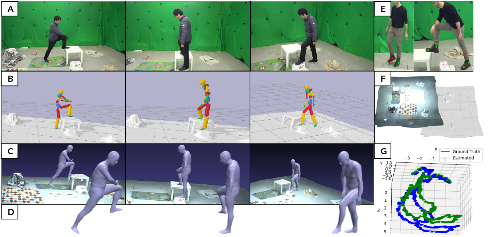

# PhysDynPose

Official repository for the PhysDynPose method and the MoviCam dataset introduced in the CVPRW 2025 paper [PhysDynPose with MoviCam dataset](https://arxiv.org/pdf/2507.17406).



## Table Of Contents

- [Dependencies](#dependencies)
- [Installation](#installation)
- [Body Models](#body-models)
- [Release Artifacts](#release-artifacts)
- [Dataset](#dataset)
- [Running The Code](#running-the-code)
- [Run One Script](#run-one-script)
- [Run Step By Step](#run-step-by-step)
- [Custom Sequence](#custom-sequence)
- [Acknowledgements](#acknowledgements)

## Dependencies

- PhysDynPose was last checked with Python `3.9.18`, PyTorch `2.1.0`, and PyTorch3D `0.7.5`.
- Python packages listed in [requirements.txt](requirements.txt)
- [4D-Humans](https://github.com/shubham-goel/4D-Humans)
- [DROID-SLAM](https://github.com/princeton-vl/droid-slam)
- [RBDL](https://github.com/rbdl/rbdl) with Python bindings

For the RBDL bindings:

```bash
export PYTHONPATH=$PYTHONPATH:/path/to/rbdl-build/python
```

If you use [run.sh](run.sh), you can also pass this through:

```bash
RBDL_PYTHON_PATH=/path/to/rbdl-build/python
```

## Installation

1. Install [4D-Humans](https://github.com/shubham-goel/4D-Humans) in its own environment by following their official installation instructions.

2. Install [DROID-SLAM](https://github.com/princeton-vl/droid-slam) in its own environment by following their official installation instructions. The one-script PhysDynPose flow assumes the DROID-SLAM checkpoint `droid.pth` is already available in that checkout, as in the official DROID-SLAM setup.

3. Clone PhysDynPose and create the optimization environment:

```bash
git clone https://github.com/aidilayce/PhysDynPose
cd PhysDynPose
conda create -y -n physopt python=3.9
conda activate physopt
pip install -r requirements.txt
```

`run.sh` assumes that 4D-Humans and DROID-SLAM are already installed elsewhere. By default it looks for:

- `../4D-Humans`
- `../DROID-SLAM`

You can override those locations with:

- `FOURD_HUMANS_ROOT=/path/to/4D-Humans`
- `DROID_SLAM_ROOT=/path/to/DROID-SLAM`

## Body Models

SMPL model files are not included in this repository. Download them from the [official SMPL website](https://smpl.is.tue.mpg.de/) under the terms of the SMPL license, then place them at the paths expected by the code:

```text
models/SMPL_male_10PCs.pkl
data/body_models/smpl/SMPL_MALE.pkl
data/body_models/smpl/SMPL_FEMALE.pkl
data/body_models/smpl/SMPL_NEUTRAL.pkl
data/J_regressor_extra.npy
```

The optimizer and alignment code use `models/SMPL_male_10PCs.pkl` through [config.py](config.py). The result-conversion code uses `data/body_models/smpl/` and `data/J_regressor_extra.npy` through [lib/models/smpl.py](lib/models/smpl.py).

## Release Artifacts

This release is split into separate artifacts.

### Download Links

You can download the dataset from Edmond. There are 2 releases: raw dataset and processed sequences for direct PhysDynPose input.

- [MoviCam raw dataset archive](https://edmond.mpg.de/file.xhtml?fileId=345390&version=1.0)
- [PhysDynPose inputs archive](https://edmond.mpg.de/file.xhtml?fileId=345391&version=1.0)

### 1. Code Repository

This repository contains the PhysDynPose code, model definitions, scene assets used by the optimizer, and scripts for preprocessing, optimization, conversion, and visualization.

Results are written under `outputs/` when the pipeline is run locally.

### 2. MoviCam Raw Dataset Archive

Download `MoviCam.zip` from Edmond and extract it as a top-level `Data/` directory. Use this archive for the raw moving-camera recordings and the processed MoviCam benchmark data.

### 3. PhysDynPose Inputs Archive

Download `inputs.zip` from Edmond and extract it inside this repository as `inputs/`. It contains the sequence-dependent contact labels and PIP reference pose/shape files needed by the released scripts.

## Dataset

See [DATASET.md](DATASET.md) for the full dataset layout, sequence list, and file-level description.

For the full raw-data pipeline, make the extracted MoviCam recording folders visible at the code-side path:

```bash
mkdir -p inputs/recordings
ln -s /path/to/Data/Recordings_31_03_23 inputs/recordings/Recordings_31_03_23
ln -s /path/to/Data/Recordings_24_03_23 inputs/recordings/Recordings_24_03_23
```

Keep the `inputs/` archive extracted as well; it provides the PIP reference files used by conversion and alignment.

## Running The Code

You can either run the complete raw-data pipeline with one script or run the stages manually.

### Run One Script

[run.sh](run.sh) runs this order:

1. extract the sequence frame range from the synced moving-camera video, if `--video_path` is provided
2. run 4D-Humans on the cropped frames
3. run DROID-SLAM on the same cropped frames
4. run [align_slam.py](align_slam.py)
5. run [run_opt.py](run_opt.py)
6. run [convert_res.py](convert_res.py)
7. optionally run [visualizer.py](visualizer.py)

The script assumes:

- 4D-Humans is already installed in its own folder
- DROID-SLAM is already installed in its own folder
- the PhysDynPose repo root is the current working directory
- `RBDL_PYTHON_PATH` is set if your PhysDynPose environment needs it

Example with one input video:

```bash
FOURD_HUMANS_ROOT=/path/to/4D-Humans \
DROID_SLAM_ROOT=/path/to/DROID-SLAM \
FOURD_HUMANS_PYTHON=/path/to/4d-humans/bin/python \
DROID_SLAM_PYTHON=/path/to/droid-slam/bin/python \
ALIGN_PYTHON=/path/to/physcap/bin/python \
OPT_PYTHON=/path/to/PIP/bin/python \
CONVERT_PYTHON=/path/to/physcap/bin/python \
VIS_PYTHON=/path/to/physcap/bin/python \
RBDL_PYTHON_PATH=/path/to/rbdl-build/python \
./run.sh --seq_no 6 --surface 31 --video_path /path/to/SonyRX0_motion_001.mp4 --visualize
```

If you already extracted the correct sequence frame range yourself, pass the frame folder directly:

```bash
./run.sh --seq_no 6 --surface 31 --frames_dir /path/to/cropped_frames
```

Important: when you use `--frames_dir`, those frames must already match the sequence frame range configured in [config.py](config.py). If you use `--video_path`, [extract_movicam_frames.py](extract_movicam_frames.py) applies that cropping automatically.

Script options:

- `--seq_no`: sequence id
- `--surface`: `24` or `31`
- `--video_path`: synced moving-camera video to crop automatically
- `--frames_dir`: already cropped frame directory
- `--visualize`: launch the final PyBullet visualization
- `--no-slam`: skip DROID-SLAM and use `cam_ext.npy` instead

The released `inputs/` archive does not include precomputed `outputs/pip_input/` tensors. Run [align_slam.py](align_slam.py) first, either through [run.sh](run.sh) or manually, before calling `run_opt.py`.

Examples:

```bash
python3 run_opt.py --seq_no 6 --surface 31 --slam
```

```bash
python3 run_opt.py --seq_no 2 --surface 24 --slam
```

For locally generated non-SLAM inputs, use `--no-slam` instead.

### Run Step By Step

#### 1. Extract the sequence frames

If you start from the synced moving-camera video, crop the frame range used by this release:

```bash
python3 extract_movicam_frames.py \
    --video_path /path/to/SonyRX0_motion_001.mp4 \
    --seq_no 6 \
    --surface 31 \
    --output_dir outputs/raw_frames/seq6_31
```

#### 2. Run 4D-Humans

Follow the official [4D-Humans](https://github.com/shubham-goel/4D-Humans) installation in their repository.

The release-facing path expects:

```text
inputs/4d_humans/outputs_XX/out_list.pkl
```

Example using their `demo.py` entry point on the cropped frames:

```bash
cd /path/to/4D-Humans
conda activate 4D-humans
python demo.py \
    --img_folder /path/to/PhysDynPose/outputs/raw_frames/seq6_31 \
    --out_folder /path/to/PhysDynPose/inputs/4d_humans/outputs_06
```

The release wrapper uses `demo.py` because it writes `out_list.pkl` directly. If you prefer another 4D-Humans entry point, such as:

```bash
python track.py \
    video.source='/path/to/mov01_indoor_31_03_23.mp4' \
    video.output_dir='phalp_mov01_indoor_31_03_23'
```

then make sure the final artifact consumed by PhysDynPose still ends up at `inputs/4d_humans/outputs_XX/out_list.pkl`.

#### 3. Run DROID-SLAM

Follow the official [DROID-SLAM](https://github.com/princeton-vl/droid-slam) installation in their repository.

PhysDynPose includes a small wrapper, [run_droid_slam.py](run_droid_slam.py), that runs the external DROID-SLAM checkout and exports the trajectory in the text format consumed by [align_slam.py](align_slam.py):

```bash
/path/to/droid-slam/bin/python run_droid_slam.py \
    --droid_root /path/to/DROID-SLAM \
    --imagedir outputs/raw_frames/seq6_31 \
    --seq_no 6 \
    --surface 31 \
    --output inputs/slam/Trajectory.txt
```

This writes the trajectory to:

```text
inputs/slam/Trajectory.txt
```

#### 4. Generate PIP inputs

```bash
python3 align_slam.py --seq_no 6 --surface 31 --slam
```

#### 5. Run motion optimization

```bash
python3 run_opt.py --seq_no 6 --surface 31 --slam
```

#### 6. Convert the optimized result

```bash
python3 convert_res.py --seq_no 6 --surface 31 --method PIP --slam
```

#### 7. Visualize

```bash
python3 visualizer.py --seq_no 6 --surface 31 --method pip --slam
```

Useful visualization options:

- `--no-scene` disables the bundled scene URDF

### Custom Sequence

For a custom MoviCam sequence:

1. Copy the recording folder to `inputs/recordings/Recordings_<surface>_03_23/seq<id>_captury/`.
2. Provide the synced moving-camera video for that sequence.
3. Add or update the frame range for that sequence in [config.py](config.py).
4. Run the full pipeline either with [run.sh](run.sh) or with the separate steps above.
5. If you need [convert_res.py](convert_res.py), also provide the matching reference files under `inputs/pip_reference/dataset_captury/seqXX/`.

Flat-scene mapping used by this release:

- `surface=24, seq1 -> seq8`
- `surface=24, seq2 -> seq9`

## Acknowledgements

This release builds on external methods and codebases, especially:

- [4D-Humans](https://github.com/shubham-goel/4D-Humans)
- [DROID-SLAM](https://github.com/princeton-vl/droid-slam)
- PIP
- PhysCap
- PyBullet
